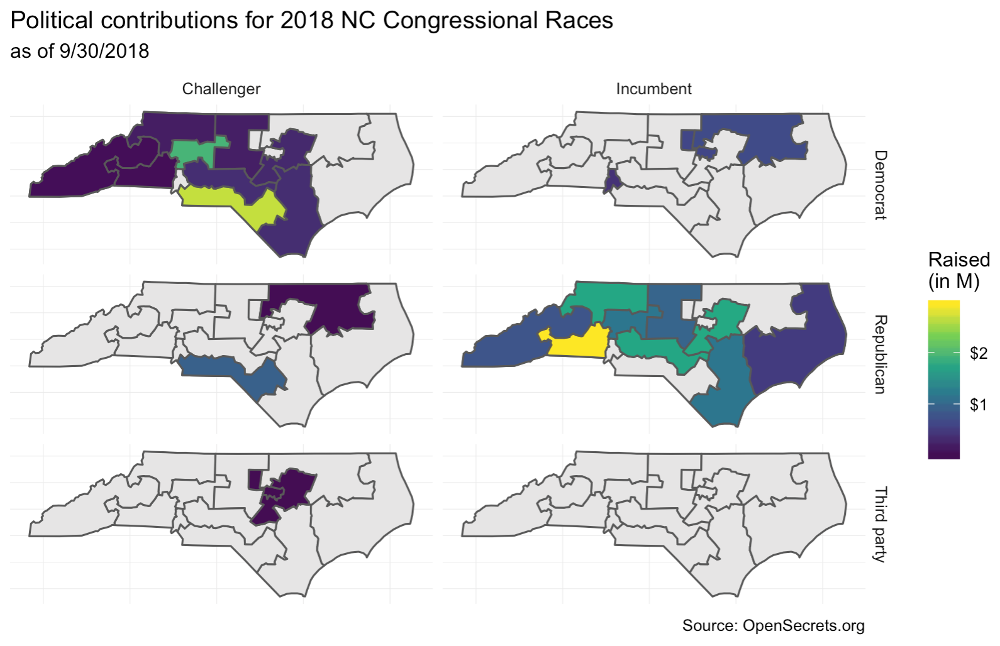

```{r child = "../setup.Rmd"}
```

```{r packages, echo=FALSE, message=FALSE, warning=FALSE}
library(tidyverse)
conflict_prefer("filter", "dplyr")
library(unvotes)
library(lubridate)
library(openintro)
library(infer)
```

## Goals

- Outline a curriculum for an introductory data science course 
- Discuss pedagogical decisions that go into the choice of topics and concepts: 
  - Programming language (R) and syntax (primarily tidyverse)
  - Emphasis on literate programming for reproducibility (with R Markdown)

---

## Exercise: `01-unvotes`

- Go to [rstd.io/sigcse19-cloud](https://rstd.io/sigcse19-cloud)
- Start the assignment titled `01 - UN Votes` and open the document called `01-unvotes.Rmd`

```{r out.width="100%", echo=FALSE}

```

<br>

.pull-left[
- Now you get to run your (possibly first) R code! Knit the document, view the
plot you produced, and complete the two tasks
]
.pull-right[
```{r out.width="100%", echo=FALSE}

```
]

---

class: center, middle, inverse

## Curriculum

---

## Context

.large[
An introductory data science course that

<br>

`r emo::ji("hatching_chick")` &nbsp; assumes no background  
`r emo::ji("mag")` &nbsp; focuses on EDA + modeling & inference + modern computing  
`r emo::ji("woman_technologist")` &nbsp; uses R as the programming languag  
`r emo::ji("busts_in_silhouette")` &nbsp; requires reproducibility  
`r emo::ji("two_women_holding_hands")` &nbsp; emphasizes collaboration + effective communication  
]

---

## GAISE College Report College Report 2016

```{r echo=FALSE}

```

.footnote[
[Guidelines for Assessment & Instruction in Statistics Education College Report College Report 2016](https://www.amstat.org/asa/files/pdfs/GAISE/GaiseCollege_Full.pdf)
]

---

## GAISE 2016

.pull-left[
### What they said
```{r out.width="100%", echo=FALSE}

```
]
.pull-right[
### What I read
- **NOT** a commonly used subset of tests and intervals and produce them with hand calculations
]

---

## GAISE 2016

.pull-left[
### What they said
```{r out.width="100%", echo=FALSE}

```
]
.pull-right[
### What I read
- **NOT** a commonly used subset of tests and intervals and produce them with hand calculations
- Multivariate analysis requires the use of computing
]

---

## GAISE 2016

.pull-left[
### What they said
```{r out.width="100%", echo=FALSE}

```
]
.pull-right[
### What I read
- **NOT** a commonly used subset of tests and intervals and produce them with hand calculations
- Multivariate analysis requires the use of computing
- **NOT** use technology that is only applicable in the intro course or that doesn’t follow good science principles
]

---

## GAISE 2016

.pull-left[
### What they said
```{r out.width="100%", echo=FALSE}

```
]
.pull-right[
### What I read
- **NOT** a commonly used subset of tests and intervals and produce them with hand calculations
- Multivariate analysis requires the use of computing
- **NOT** use technology that is only applicable in the intro course or that doesn’t follow good science principles
- Data analysis isn’t just inference and modeling, it’s also data importing, cleaning, preparation, exploration, and visualization
]

---

## Learning units

```{r out.width="100%", echo=FALSE}
knitr::include_graphics("images/topic-flow-0.png")
```

---

## Unit 1 - Exploring data

```{r out.width="100%", echo=FALSE}

```

- Data visualization and data wranling
- Confounding variables, and Simpson’s paradox 
- Tidy data, data import, data cleaning, data collection (including web scraping to introduce the idea of iteration in preparation for the next unit) 
- Introduction to the toolkit: R, RStudio, R Markdown, Git, GitHub, etc.

---

## Unit 2 - Making rigorous conclusions

```{r out.width="100%", echo=FALSE}

```

- Modeling and statistical inference for making data based conclusions
- Building, interpreting, and selecting models, visualizing interaction effects, and prediction and model validity. 
- Statistical inference via simulation (randomization + bootstrapping)

---

## Unit 3 - Looking forward

```{r out.width="100%", echo=FALSE}

```

- Whatever you like!
- Independent modules that instructors can choose to include in their introductory data science curriculum depending on how much time they have left in the semester.
- Interactive reporting and visualizaiton with Shiny, text analysis, Bayesian inference, etc.

---

class: center, middle, inverse

## Pedagogy

---

class: middle

## Five guiding principles

.xlarge[
`r emo::ji("cake")` &nbsp; start with cake  
`r emo::ji("baby_symbol")` &nbsp; skip baby steps  
`r emo::ji("spiral_calendar")` &nbsp; cherish day one  
`r emo::ji("broccoli")` &nbsp; hide the veggies  
`r emo::ji("earth_americas")` &nbsp; leverage the ecosystem  
]

---

class:middle

.bigquestion[
Which of the following gives you a **better** sense of the final product?
]

---

background-image: url(https://www.psdgraphics.com/wp-content/uploads/2017/03/red-white-gingham.jpg)
background-size: cover 
class: center, middle

.cutout[
Pinapple and coconut sandwich
]

---

background-image: url(https://www.psdgraphics.com/wp-content/uploads/2017/03/red-white-gingham.jpg)
background-size: cover 
class: center, middle

.cutout[
Pinapple and coconut sandwich
```{r echo=FALSE}

```
]

---

background-image: url(https://www.psdgraphics.com/wp-content/uploads/2017/03/red-white-gingham.jpg)
background-size: cover 
class: center, middle

.cutout[
Pinapple and coconut sandwich `r emo::ji("arrow_forward")`
```{r echo=FALSE}

```
]

<embed src="images/gbbo-audio.m4a" width="32" height="32"></embed>

---

class: center, middle

<!--
<video width="800" height="600">
<source src="images/cake-video.mov" type="video/mp4">
</video>

<embed src="images/cake-video.mov" width="800" height="600"></embed>
-->

---

class: middle, center

.huge[
`r emo::ji("cake")` &nbsp; start with cake 
]

---

class: middle

.bigquestion[
Which of the following is more likely to be **motivating** for a wide range of students? 
]

---

.pull-left[
**Option 1:**
- Declare the following variables
- Then, determine the class of each variable

```{r}
# Declare variables
x <- 8
y <- "monkey"
z <- FALSE 

# Check classes
class(x)
class(y)
class(z)
```
]
--

.pull-right[
**Option 2:**
- Open today’s demo project
- Knit the document and discuss the results with your neighbor

<br>

```{r echo=FALSE, warning=FALSE, out.width="120%"}
un_votes %>%
  dplyr::filter(country %in% c("United States of America", "Turkey")) %>%
  mutate(country = ifelse(country == "United States of America", "US", country)) %>%
  inner_join(un_roll_calls, by = "rcid") %>%
  inner_join(un_roll_call_issues, by = "rcid") %>%
  group_by(country, year = year(date), issue) %>%
  summarize(
    votes = n(),
    percent_yes = mean(vote == "yes")
    ) %>%
  dplyr::filter(votes > 5) %>%  # only use records with > 5 votes
  ggplot(mapping = aes(x = year, y = percent_yes, color = country)) +
    geom_point() +
    geom_smooth(method = "loess", se = FALSE) +
    facet_wrap(~ issue) +
    labs(
      title = "Percentage of 'Yes' votes\nin the UN General Assembly",
      subtitle = "1946 to 2015",
      y = "% Yes",
      x = "Year",
      color = "Country"
    )
```
- Then, change `Turkey` to a different country, and plot again
]

---

## start with`r emo::ji("cake")` = start with `r emo::ji("bar_chart")`

- **Familiarity:** Students have likely previously encountered data visualizations
- **Intuition:** Interpretation of a data visualization, even a complex one on a dataset with a familiar context, requires little to no instruction
- **Ease:** It's not necessarily easy to make visualizations, but it can be easier for students to catch their own mistakes than when doing data manipulation or building models
- **Shift in flow:** Teach data science first, then programming, i.e. delay introducing important programming basics (e.g. variable types, data structures)

---

class: middle, center

.huge[
`r emo::ji("baby_symbol")` &nbsp; skip baby steps  
]

---

class: middle

.bigquestion[
Which of the following is more likely to **inspire** students to want to learn more?
]

---

.pull-left[
**Option 1:**
Create a visualization displaying whether the vote was on an amendment.

<br><br>

```{r echo=FALSE, warning=FALSE, out.width="100%"}
ggplot(data = un_roll_calls, mapping = aes(x = amend)) +
  geom_bar()
```
]
--

.pull-right[
**Option 2:**
Create a visualization displaying how US and Turkey voted over the years on issues of arms control and disarmament, colonialism, economic development, human rights, nuclear weapons, and Palestinian conflict.

<br><br>

```{r echo=FALSE, warning=FALSE, out.width="120%"}
un_votes %>%
  dplyr::filter(country %in% c("United States of America", "Turkey")) %>%
  mutate(country = ifelse(country == "United States of America", "US", country)) %>%
  inner_join(un_roll_calls, by = "rcid") %>%
  inner_join(un_roll_call_issues, by = "rcid") %>%
  group_by(country, year = year(date), issue) %>%
  summarize(
    votes = n(),
    percent_yes = mean(vote == "yes")
    ) %>%
  dplyr::filter(votes > 5) %>%  # only use records with > 5 votes
  ggplot(mapping = aes(x = year, y = percent_yes, color = country)) +
    geom_point() +
    geom_smooth(method = "loess", se = FALSE) +
    facet_wrap(~ issue) +
    labs(
      title = "Percentage of 'Yes' votes\nin the UN General Assembly",
      subtitle = "1946 to 2015",
      y = "% Yes",
      x = "Year",
      color = "Country"
    )
```
]

---

class: middle, center

.xlarge[
but with great examples,

comes a great amount of code...
]

---

**Option 1:**
Create a visualization displaying whether the vote was on an amendment.

```{r warning=FALSE}
ggplot(data = un_roll_calls, mapping = aes(x = amend)) +
  geom_bar()
```

---

**Option 2:**
Create a visualization displaying how US and Turkey voted over the years on issues of arms control and disarmament, colonialism, economic development, human rights, nuclear weapons, and Palestinian conflict.

.pull-left[
.small[
```{r unplot, fig.show="hide", warning=FALSE}
un_votes %>%
  filter(country %in% c("United States of America", "Turkey")) %>%
  inner_join(un_roll_calls, by = "rcid") %>%
  inner_join(un_roll_call_issues, by = "rcid") %>%
  group_by(country, year = year(date), issue) %>%
  summarize(
    votes = n(),
    percent_yes = mean(vote == "yes")
    ) %>%
  filter(votes > 5) %>%  # only use records with > 5 votes
  ggplot(mapping = aes(x = year, y = percent_yes, color = country)) +
    geom_point() +
    geom_smooth(method = "loess", se = FALSE) +
    facet_wrap(~ issue) +
    labs(
      title = "Percentage of 'Yes' votes\nin the UN General Assembly",
      subtitle = "1946 to 2015",
      y = "% Yes",
      x = "Year",
      color = "Country"
    )
```
]
]
.pull-right[
```{r ref.label="unplot", echo=FALSE, warning=FALSE, out.width="100%"}
```
]

---

class: middle, center

.xlarge[
non-trivial examples can be motivating, 

but need to avoid `r emo::ji("point_down")`!
]

<br>

```{r echo=FALSE,out.width="50%"}

```

---

### Take a look at the data

```{r include=FALSE}
un_votes_joined <- un_votes %>%
  filter(country %in% c("United States of America", "Turkey")) %>%
  inner_join(un_roll_calls, by = "rcid") %>%
  inner_join(un_roll_call_issues, by = "rcid") %>%
  group_by(country, year = year(date), issue) %>%
  summarize(
    votes = n(),
    percent_yes = mean(vote == "yes")
    ) %>%
  filter(votes > 5) %>% # only use records with > 5 votes 
  ungroup()
```

```{r}
un_votes_joined
```

---

### Start with a blank canvas

.pull-left[
.small[
```{r unplot-reveal-1, fig.show="hide", warning=FALSE}
ggplot(data = un_votes_joined) #<<
```
]
]
.pull-right[
```{r ref.label="unplot-reveal-1", echo=FALSE, warning=FALSE, out.width="120%"}
```
]

---

### Map `year` to the x-axis

.pull-left[
.small[
```{r unplot-reveal-2, fig.show="hide", warning=FALSE}
ggplot(data = un_votes_joined,
       mapping = aes(x = year)) #<<
```
]
]
.pull-right[
```{r ref.label="unplot-reveal-2", echo=FALSE, warning=FALSE, out.width="120%"}
```
]

---

### Map `percent_yes` to the y-axis

.pull-left[
.small[
```{r unplot-reveal-3, fig.show="hide", warning=FALSE}
ggplot(data = un_votes_joined,
       mapping = aes(x = year, y = percent_yes)) #<<
```
]
]
.pull-right[
```{r ref.label="unplot-reveal-3", echo=FALSE, warning=FALSE, out.width="120%"}
```
]

---

### Represent each observation with a point

.pull-left[
.small[
```{r unplot-reveal-4, fig.show="hide", warning=FALSE}
ggplot(data = un_votes_joined,
       mapping = aes(x = year, y = percent_yes)) +
  geom_point() #<<
```
]
]
.pull-right[
```{r ref.label="unplot-reveal-4", echo=FALSE, warning=FALSE, out.width="120%"}
```
]

---

### Color the points by country

.pull-left[
.small[
```{r unplot-reveal-5, fig.show="hide", warning=FALSE}
ggplot(data = un_votes_joined,
       mapping = aes(x = year, y = percent_yes,
                     color = country)) +  #<<
  geom_point()
```
]
]
.pull-right[
```{r ref.label="unplot-reveal-5", echo=FALSE, warning=FALSE, out.width="120%"}
```
]

---

### Add a smooth line for each country

.pull-left[
.small[
```{r unplot-reveal-6, fig.show="hide", warning=FALSE}
ggplot(data = un_votes_joined,
       mapping = aes(x = year, y = percent_yes,
                     color = country)) +
  geom_point() +
  geom_smooth(method = "loess", se = FALSE) #<<
```
]
]
.pull-right[
```{r ref.label="unplot-reveal-6", echo=FALSE, warning=FALSE, out.width="120%"}
```
]

---

### Facet by `issue`

.pull-left[
.small[
```{r unplot-reveal-7, fig.show="hide", warning=FALSE}
ggplot(data = un_votes_joined,
       mapping = aes(x = year, y = percent_yes,
                     color = country)) +
  geom_point() +
  geom_smooth(method = "loess", se = FALSE) + 
  facet_wrap(~ issue) #<<
```
]
]
.pull-right[
```{r ref.label="unplot-reveal-7", echo=FALSE, warning=FALSE, out.width="120%"}
```
]

---

### Add title

.pull-left[
.small[
```{r unplot-reveal-8, fig.show="hide", warning=FALSE}
ggplot(data = un_votes_joined,
       mapping = aes(x = year, y = percent_yes,
                     color = country)) +
  geom_point() +
  geom_smooth(method = "loess", se = FALSE) + 
  facet_wrap(~ issue) +
  labs(
    title = "Percentage of 'Yes' votes in the UN GA" #<<
  )
```
]
]
.pull-right[
```{r ref.label="unplot-reveal-8", echo=FALSE, warning=FALSE, out.width="120%"}
```
]

---

### Add subtitle

.pull-left[
.small[
```{r unplot-reveal-9, fig.show="hide", warning=FALSE}
ggplot(data = un_votes_joined,
       mapping = aes(x = year, y = percent_yes,
                     color = country)) +
  geom_point() +
  geom_smooth(method = "loess", se = FALSE) + 
  facet_wrap(~ issue) +
  labs(
    title = "Percentage of 'Yes' votes in the UN GA",
    subtitle = "1946 to 2015" #<<
  )
```
]
]
.pull-right[
```{r ref.label="unplot-reveal-9", echo=FALSE, warning=FALSE, out.width="120%"}
```
]

---

### Add axis labels

.pull-left[
.small[
```{r unplot-reveal-10, fig.show="hide", warning=FALSE}
ggplot(data = un_votes_joined,
       mapping = aes(x = year, y = percent_yes,
                     color = country)) +
  geom_point() +
  geom_smooth(method = "loess", se = FALSE) + 
  facet_wrap(~ issue) +
  labs(
    title = "Percentage of 'Yes' votes in the UN GA",
    subtitle = "1946 to 2015",
    x = "Year", y = "% Yes" #<<
  )
```
]
]
.pull-right[
```{r ref.label="unplot-reveal-10", echo=FALSE, warning=FALSE, out.width="120%"}
```
]

---

### Add legend title

.pull-left[
.small[
```{r unplot-reveal-11, fig.show="hide", warning=FALSE}
ggplot(data = un_votes_joined,
       mapping = aes(x = year, y = percent_yes,
                     color = country)) +
  geom_point() +
  geom_smooth(method = "loess", se = FALSE) + 
  facet_wrap(~ issue) +
  labs(
    title = "Percentage of 'Yes' votes in the UN GA",
    subtitle = "1946 to 2015",
    x = "Year", y = "% Yes",
    color = "Country" #<<
  )
```
]
]
.pull-right[
```{r ref.label="unplot-reveal-11", echo=FALSE, warning=FALSE, out.width="120%"}
```
]

---

## Exercise: `02-unvotes-revisited`

- Go to [rstd.io/sigcse19-cloud](https://rstd.io/sigcse19-cloud)
- Start the assignment titled `02 - UN Votes Revisited` and open the R Markdown (`.Rmd`) document
- Knit the document to reveal your task

---

class: middle, center

.huge[
`r emo::ji("spiral_calendar")` &nbsp; cherish day one  
]

---

class:middle

.bigquestion[
Which of the following is more likely to be **welcoming** for a wide range of students? 
]

---

.pull-left[
**Option 1:**
- Install R
- Install RStudio
- Install the following packages:
  - tidyverse
  - rmarkdown
  - ...
… Load these packages
- Install git
]
--

.pull-right[
**Option 2:**
- Go to rstudio.cloud (or some other server based solution)
- Log in with your ID & pass

`> hello R!`
]

--

<br><br>

.large[
more on this in Part 2...
]

---

class: middle, center

.huge[
`r emo::ji("broccoli")` &nbsp; hide the veggies  
]

---

class:middle

.bigquestion[
Which of the following is more likely to be **interesting** for a wide range of students? 
]

---

.left-column[
**Option 1:**
- Topic: Web scraping
- Tools: 
  - `rvest`
  - regular expressions
]
--

.right-column[
**Option 2:**
- Today we start with this:
```{r echo=FALSE, out.width="40%", fig.align="left"}

```
- and end with this:
```{r echo=FALSE, out.width="50%", fig.align="left"}

```
- and do so in a way that is easy to replicate for another state
]

---

class: middle, center

.xlarge[
students will encounter lots of new challenges along the way — 

let that happen,

and then provide a solution
]

---

- **Lesson:** Web scraping essentials for turning a structured table into a data frame in R.

--
- **Ex 1:** Scrape the table off the web and save as a data frame.

```{r echo=FALSE, out.width="50%"}
knitr::include_graphics("images/opensecrets-nc01-small.png")
```
```{r echo=FALSE, out.width="60%"}

```

--
.pull-left[
- **Ex 2:** What other information do we need represented as variables in the data to obtain the desired facets? 
]
.pull-right[
```{r echo=FALSE, out.width="60%"}

```
]

--
- **Lesson:** “Just enough” string parsing and regular expressions to achieve

```{r echo=FALSE}
knitr::include_graphics("images/opensecrets-nc01-parsed.png")
```

---

class: middle, center

.huge[
`r emo::ji("earth_americas")` &nbsp; leverage the ecosystem  
]

---

## What ecosystem?

```{r echo=FALSE, out.width="100%"}

```


---

.question[
Estimate the difference between the average evaluation score of male and female faculty.
]

```{r echo=FALSE, message=FALSE}
evals <- read_csv("data/evals.csv")
evals %>%
  select(score, rank, ethnicity, gender, bty_avg)
```

---

## Base R

.question[
Estimate the difference between the average evaluation score of male and female faculty.
]

```{r}
t.test(evals$bty_avg ~ evals$gender)
```

---

## Tidyverse

.huge[
`r emo::ji("woman_shrugging")`
]

---

```{r echo=FALSE}
set.seed(131)
```


## **infer**: Built with tidy principles in mind

```{r}
library(tidyverse)
library(infer)

evals %>%
  specify(score ~ gender) %>%
  generate(reps = 1000, 
    type = "bootstrap") %>%
  calculate(stat = "diff in means", 
    order = c("male", "female")) %>%
  summarise(
    l = quantile(stat, 0.025), 
    u = quantile(stat, 0.975)
    )
```

.footnote[
[infer.netlify.com](https://infer.netlify.com)
]

---

### Start with data

```{r}
evals #<<
```

---

### Specify the model

```{r}
evals %>%
  specify(score ~ gender) #<<
```

---

### Generate bootstrap samples

```{r}
evals %>%
  specify(score ~ gender) %>%
  generate(reps = 1000, type = "bootstrap")  #<<
```

---

### Calculate sample statistics

```{r}
evals %>%
  specify(score ~ gender) %>%
  generate(reps = 1000, type = "bootstrap") %>%
  calculate(stat = "diff in means", order = c("male", "female")) #<<
```

---

### Visualize the bootstrap distribution

Using syntax students are already familiar with from `ggplot2`:

```{r message=FALSE, out.width="40%"}
evals %>%
  specify(score ~ gender) %>%
  generate(reps = 1000, type = "bootstrap") %>%
  calculate(stat = "diff in means", order = c("male", "female")) %>%
  ggplot(mapping = aes(x = stat)) + #<<
    geom_histogram() #<<
```

---

### Summarise CI bounds

Using syntax students are already familiar with from `dplyr`:

```{r}
evals %>%
  specify(score ~ gender) %>%
  generate(reps = 1000, type = "bootstrap") %>%
  calculate(stat = "diff in means", order = c("male", "female")) %>%
  summarise(l = quantile(stat, 0.025), u = quantile(stat, 0.975)) #<<
```
  
---

class: center, middle

.xlarge[
want to see the full curriculum?
]

---

```{r out.width="100%", echo=FALSE}

```

