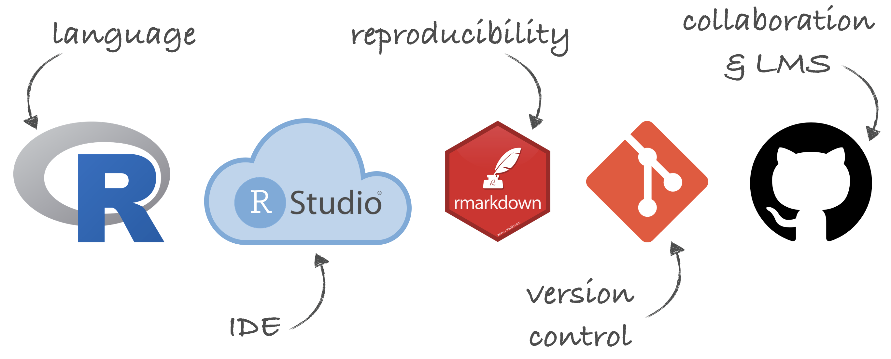

```{r child = "../setup.Rmd"}
```

```{r packages, echo=FALSE, message=FALSE, warning=FALSE}
library(tidyverse)
library(unvotes)
```

class: center, middle, inverse

## Toolkit

---

## Toolkit

```{r out.width="100%", fig.align="center", echo=FALSE}

```

---

## Why R?

- **Goal:** Teach data science, and motivate a foray into programming
- Not just R, but a very opiniated (but widely used) subset of R
  
  
---

## Why RStudio Cloud?

- **Goals:**
  - Reduce friction at first exposure to R
  - Avoid local installation
- **Approach:** Install R and RStudio on a server and provide access to students
- **Solutions:**
  - Centralized RStudio server<sup>*</sup>
  - Dockerized RStudio server<sup>*</sup>
  - RStudio Cloud: Doesn't require IT support + Features designed for instructors
    
.footnote[
[*] Çetinkaya-Rundel, Mine, and Rundel, Colin. "Infrastructure and tools for teaching computing throughout the statistical curriculum." The American Statistician (2018). Part of the Practical Data Science for Stats collection.
]
  
---

## Exercise: `03 - Your own course on Cloud!`

.midi[
- Go to [rstudio.cloud](https://rstudio.cloud/)
- Create a new workspace, call it `SIGCSE 19`
- Create a new project in this workspace, call it `HW 01`, make it visible to others in the workspace as an assignment: 
  - `r emo::ji("gear")`  $\rightarrow$ *Access* $\rightarrow$ Who can view this project: *Everyone in the workspace* 
  - *Make this project and assignment*
- Add a template R Markdown document:
  - *File* $\rightarrow$ *New File* $\rightarrow$ *R Markdown* $\rightarrow$ It will ask you to install required packages, say *Yes*
  - In the New R Markdown pop-up window: Give your document a *Title* and add your name as *Author*, leave output format as *HTML*
  - Knit to view the output, which will prompt you to name your document
- Go back to your workspace by clicking on the workspace name on the top left
- Click on *Members*, and under Options choose *Shared*, and *Copy Sharing Link*
- Email the sharing link for your workspace to your neighbor
- **Students:** Start assignment, make some change to the R Markdown document and knit it, then close the project
- **Instructors:** Peek into your student’s project
]

---

## RStudio Cloud: Instruction features

- **Workspaces:**
  - When you create an account on RStudio Cloud you get a workspace of your own - projects you create here are public
  - You can add a new workspace and control its permissions - projects you create here can be public or private

--
- **User roles:**
  - Admin: manage users, view, edit and manage all projects $\rightarrow$ instructor
  - Moderator: view, edit and manage all projects	$\rightarrow$ TA
  - Contributor: create, edit and manage their own projects	$\rightarrow$ student
  - Viewer: view projects shared with everyone $\rightarrow$ auditor

--
- **Versatility:** 
  - Can run Python code in R Markdown (via reticulate)
  - RStudio (Cloud) will soon support Jupyter notebooks as well

---

## Why R Markdown?

- Reproducibility is built in
- Code and output are inseparable
- Prose can inserted easily throughout the analysis

---

## Why Git & GitHub?

- Teach students tools that will grow with them, and tools for better science
- Lots of mistakes along the way, need ability keep track of history (and revert)
- Platform and interface designed to enable collaboration
- Transparent commit history
- Mastery takes time, starting early helps
- Good for marketability + discoverability of students

---

## How Git & GitHub GitHub?

.xlarge[
more on this in Part 3...
]
